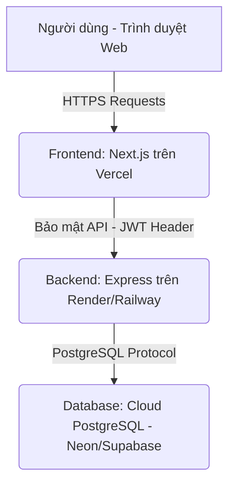

# Hướng dẫn Triển khai Hệ thống lên Môi trường Sản xuất (Production Deployment Guide)

Tài liệu này hướng dẫn chi tiết từng bước chuẩn bị và triển khai dự án **Healthcare Booking System** (cả Frontend Next.js và Backend Express/Prisma) lên môi trường sản xuất thực tế.

---

## Sơ đồ Kiến trúc Triển khai (Deployment Architecture)



---

## Bước 1: Thiết lập Cơ sở dữ liệu Cloud PostgreSQL
Hệ thống sử dụng Prisma ORM kết nối với PostgreSQL. Bạn cần khởi tạo một cơ sở dữ liệu Postgres trực tuyến.

### Các nhà cung cấp PostgreSQL đám mây khuyên dùng:
1. **Neon.tech** (Khuyên dùng - Cực kỳ nhanh và miễn phí cấu hình thấp).
2. **Supabase.com** (Cung cấp Postgres đầy đủ tính năng).
3. **Aiven.io** hoặc **Railway Database**.

### Các bước cấu hình:
1. Đăng ký tài khoản và tạo một dự án PostgreSQL mới.
2. Sao chép chuỗi kết nối cơ sở dữ liệu trực tuyến. Nó sẽ có dạng như sau:
   `postgresql://[user]:[password]@[host]:5432/[database]?sslmode=require`
3. Lưu chuỗi kết nối này lại để điền vào biến môi trường `DATABASE_URL` của Backend.

---

## Bước 2: Triển khai Backend (Node.js + Express + Prisma)
Backend có thể được triển khai dễ dàng lên **Render.com** hoặc **Railway.app**.

### Cấu hình biến môi trường trên Render/Railway:
Thêm các biến môi trường sau vào bảng điều khiển (Environment Variables panel):

| Tên Biến | Giá trị mẫu / Hướng dẫn |
| :--- | :--- |
| `PORT` | `5000` (Hoặc Render/Railway sẽ tự động điền) |
| `NODE_ENV` | `production` |
| `DATABASE_URL` | *Điền chuỗi kết nối PostgreSQL nhận được từ Bước 1* |
| `JWT_SECRET` | *Một chuỗi ký tự ngẫu nhiên, dài và phức tạp để bảo mật chữ ký token* |
| `CORS_ORIGIN` | *URL của Frontend sau khi deploy trên Vercel (ví dụ: `https://medbooking.vercel.app`)* |

### Cấu hình kịch bản Khởi chạy & Migration trên Hosting:
* **Build Command**: `npm run build`
  *(Lệnh này sẽ tự động kích hoạt sinh Prisma Client `prisma generate` và biên dịch mã nguồn TypeScript thành JS trong thư mục `dist/`)*
* **Start Command**: `npm run prisma:migrate && npm start`
  *(Thao tác này đảm bảo database được cập nhật cấu trúc schema mới nhất qua `prisma migrate deploy` trước khi máy chủ Express chính thức hoạt động)*

---

## Bước 3: Triển khai Frontend (Next.js 15)
Nền tảng tốt nhất để triển khai ứng dụng Next.js là **Vercel**.

### Các bước thực hiện:
1. Đăng nhập vào [Vercel](https://vercel.com) và liên kết tài khoản GitHub của bạn.
2. Nhấp vào **Add New** -> **Project** và import kho lưu trữ dự án.
3. Chọn thư mục nguồn là `frontend` (Vercel sẽ tự động phát hiện cấu hình Next.js).
4. Thêm các biến môi trường sau trong mục **Environment Variables**:

| Tên Biến | Giá trị mẫu / Hướng dẫn |
| :--- | :--- |
| `NEXT_PUBLIC_API_URL` | *URL của Backend API đã triển khai ở Bước 2 kèm `/api` (ví dụ: `https://med-api.onrender.com/api`)* |

5. Nhấn nút **Deploy** và chờ Vercel hoàn thành tối ưu hóa trang web.

---

## Bước 4: Kiểm tra và Vận hành Bảo mật (Security Checklist)

1. **Bảo mật JWT**:
   * Tuyệt đối không chia sẻ `JWT_SECRET` trên bất kỳ kênh công khai nào.
   * Để tạo ra một chuỗi khóa bí mật JWT an toàn, hãy chạy lệnh sau trong Terminal của máy bạn:
     ```bash
     node -e "console.log(require('crypto').randomBytes(32).toString('hex'))"
     ```
2. **CORS Nghiêm ngặt**:
   * Kiểm tra xem cổng gọi API của bạn có từ chối các request từ các trang web lạ hay không. Cấu hình CORS động của dự án sẽ bảo vệ các tài nguyên hệ thống này.
3. **Tiêu đề Bảo mật**:
   * Next.js được tích hợp sẵn các tiêu đề bảo mật để tránh tấn công clickjacking (`X-Frame-Options: DENY`) và tấn công giả mạo kiểu tệp tin (`X-Content-Type-Options: nosniff`).

---

Chúc bạn triển khai thành công hệ thống **Healthcare Booking System** bảo mật và ổn định trên môi trường sản xuất!
